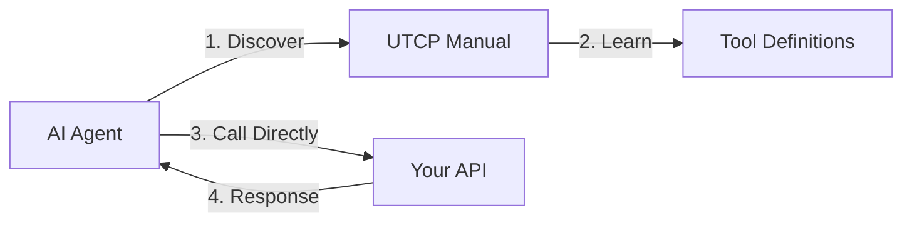

# Universal Tool Calling Protocol (UTCP)

:::info Language Examples
UTCP is available in multiple languages - see [Python](https://github.com/universal-tool-calling-protocol/python-utcp), [TypeScript](https://github.com/universal-tool-calling-protocol/typescript-utcp), [Go](https://github.com/universal-tool-calling-protocol/go-utcp), and other implementations in the [UTCP GitHub organization](https://github.com/universal-tool-calling-protocol).
:::

UTCP is a lightweight, secure, and scalable standard that enables AI agents and applications to discover and call tools directly using their native protocols - **no wrapper servers required**.

## Why UTCP?

### The Problem with Current Approaches
Most tool integration solutions force you to:
- Build and maintain wrapper servers for every tool
- Route all traffic through a middleman protocol
- Reimplement existing authentication and security
- Accept additional latency and complexity

### The UTCP Solution
UTCP acts as a **"manual"** that tells agents how to call your tools directly:

:::tip Core Philosophy
*"If a human can call your API, an AI agent should be able to call it too - with the same security and no additional infrastructure."*
:::

## OpenAPI Compatibility

UTCP extends OpenAPI for AI agents while maintaining full backward compatibility. Where OpenAPI describes APIs for human developers, UTCP adds agent-focused enhancements: `tags` for categorization, `average_response_size` for resource planning, multi-protocol support (HTTP, CLI, gRPC, MCP), and direct execution instructions. Existing OpenAPI specs can be automatically converted to UTCP manuals without requiring API changes or additional infrastructure.

## Quick Start (5 Minutes)

### 1. Install UTCP

```bash
# Example installation (Python)
pip install utcp utcp-http

# Example installation (Node.js)
npm install @utcp/core @utcp/http

# See language-specific documentation for other implementations
```

### 2. Expose Your First Tool

**Option A: Discovery via existing OpenAPI spec**

**Generate OpenAPI endpoint**: `GET http://api.github.com/openapi.json`


**Option B: Add a discovery endpoint to your existing API**

**Add endpoint**: `GET /utcp`
**Return your UTCP manual**:
```json
{
  "manual_version": "1.0.0",
  "utcp_version": "1.0.1",
  "tools": [{
    "name": "get_weather",
    "description": "Get current weather for a location",
    "inputs": {
      "type": "object",
      "properties": {"location": {"type": "string"}},
      "required": ["location"]
    },
    "tool_call_template": {
      "call_template_type": "http",
      "url": "http://localhost:8000/weather",
      "http_method": "GET"
    }
  }],
  "auth": {
    "auth_type": "api_key",
    "api_key": "${WEATHER_API_KEY}",
    "var_name": "appid",
    "location": "query"
  }
}
```

### 3. Call Your Tool

**Option A: Configure UTCP client**:
```json
{
  "manual_call_templates": [{
    "name": "weather_api", 
    "call_template_type": "http",
    "url": "http://localhost:8000/utcp", // Or http://api.github.com/openapi.json, the openapi spec gets converted automatically
    "http_method": "GET"
  }]
}
```

**Option B: Convert OpenAPI spec to UTCP manual manually**

```python
async def convert_api():
    async with aiohttp.ClientSession() as session:
        async with session.get("https://api.github.com/openapi.json") as response:
            openapi_spec = await response.json()

    converter = OpenApiConverter(openapi_spec)
    manual = converter.convert()

    print(f"Generated {len(manual.tools)} tools from GitHub API!")
    return manual
```

Then save that to a text file and load it with the text configuration:
```json
{
  "manual_call_templates": [{
    "name": "github_manual", 
    "call_template_type": "text",
    "file_path": "./github_manual.json",
  }]
}
```


**Call the tool**:
1. Initialize UTCP client with configuration
2. Discover tools from weather API  
3. Call `get_weather` tool with location parameter
4. Receive weather data response

**That's it!** Your tool is now discoverable and callable by any UTCP client.

## Key Benefits

| Benefit | Description |
|---------|-------------|
| **🚀 Zero Latency Overhead** | Direct tool calls, no proxy servers |
| **🔒 Native Security** | Use your existing authentication and authorization |
| **🌐 Protocol Flexibility** | HTTP, MCP, CLI, GraphQL, and more |
| **⚡ Easy Integration** | Add one endpoint, no infrastructure changes |
| **📈 Scalable** | Leverage your existing scaling and monitoring |

## How It Works



1. **Discovery**: Agent fetches your UTCP manual
2. **Learning**: Agent understands how to call your tools
3. **Direct Calling**: Agent calls your API directly using native protocols
4. **Response**: Your API responds normally

## Supported Protocols

UTCP supports multiple communication protocols through plugins:

| Protocol | Use Case | Plugin | Status |
|----------|----------|--------|--------|
| **[HTTP](./protocols/http.md)** | REST APIs, webhooks | `utcp-http` | ✅ Stable |
| **[CLI](./protocols/cli.md)** | Command-line tools | `utcp-cli` | ✅ Stable |
| **[Server-Sent Events](./protocols/streamable-http.md)** | Streaming data | `utcp-http` | ✅ Stable |
| **[Text Files](./protocols/text.md)** | File reading | `utcp-text` | ✅ Stable |
| **[MCP](./protocols/mcp.md)** | MCP interoperability | `utcp-mcp` | ✅ Stable |

[View all protocols →](./protocols/index.md)

## Architecture Overview

UTCP v1.0 features a modular, plugin-based architecture:

### Core Components
- **[Manuals](./api/core/utcp/data/utcp_manual.md)**: Tool definitions and metadata
- **[Tools](./api/core/utcp/data/tool.md)**: Individual callable capabilities  
- **[Call Templates](./api/core/utcp/data/call_template.md)**: Protocol-specific call instructions
- **[UTCP Client](./api/core/utcp/utcp_client.md)**: Tool discovery and execution engine

### Plugin System
- **Protocol Plugins**: HTTP, MCP, CLI, etc.
- **Custom Protocols**: Extend with your own communication methods
- **Tool Repositories**: Pluggable storage for tool definitions
- **Search Strategies**: Customizable tool discovery algorithms

[Learn more about the architecture →](./api/index.md)

## Who Should Use UTCP?

### 🛠️ Tool Providers
You have APIs, services, or tools that you want AI agents to use:
- **Existing API owners** - Expose your REST APIs to AI agents
- **SaaS providers** - Make your services AI-accessible
- **Enterprise teams** - Enable internal tool usage by AI systems

[**Get started as a tool provider →**](./for-tool-providers.md)

### 🤖 Tool Consumers  
You're building AI agents or applications that need to call external tools:
- **AI agent developers** - Give your agents access to external capabilities
- **Application builders** - Integrate third-party tools seamlessly
- **Enterprise developers** - Connect to internal and external services

[**Get started as a tool consumer →**](./implementation.md)

## UTCP vs Alternatives

| Feature | UTCP | MCP | Custom Wrappers |
|---------|------|-----|-----------------|
| **Infrastructure** | None required | Wrapper servers | Custom servers |
| **Latency** | Direct calls | Double hop | Variable |
| **Security** | Native | Reimplemented | Custom |
| **Protocols** | Multiple | HTTP streaming | Single |
| **Maintenance** | Minimal | High | Very high |

[**Detailed comparison with MCP →**](./utcp-vs-mcp.md)

## Next Steps

### For Tool Providers
1. **[Read the provider guide](./for-tool-providers.md)** - Learn how to expose your tools
2. **[Choose your protocol](./protocols/index.md)** - Select the right communication method
3. **[Implement your manual](./implementation.md)** - Add UTCP to your existing API
4. **[Secure your tools](./security.md)** - Implement proper authentication

### For Tool Consumers
1. **[Read the implementation guide](./implementation.md)** - Learn how to build UTCP clients
2. **[Explore protocols](./protocols/index.md)** - Understand available communication options
3. **[Check examples](https://github.com/universal-tool-calling-protocol)** - See real-world implementations
4. **[Join the community](https://discord.gg/ZpMbQ8jRbD)** - Get help and share experiences

### Migration from Other Systems
- **[From UTCP v1.0](./migration-v1.0-to-v1.1.md)** - Upgrade to v1.1
- **[From UTCP v0.1](./migration-v0.1-to-v1.0.md)** - Upgrade from legacy v0.1
- **[From MCP](./protocols/mcp.md)** - Migrate from Model Context Protocol
- **[From custom solutions](./implementation.md)** - Replace existing tool integrations

## Community & Support

- **[GitHub Organization](https://github.com/universal-tool-calling-protocol)** - Source code and issues
- **[Discord Community](https://discord.gg/ZpMbQ8jRbD)** - Real-time help and discussions  
- **[Tool Registry](https://utcp.io/registry)** - Discover available tools
- **[RFC Process](/about/RFC)** - Contribute to the specification

---

**Ready to get started?** Choose your path:
- 🛠️ [**I want to expose my tools**](./for-tool-providers.md)
- 🤖 [**I want to call tools**](./implementation.md)
- 📚 [**I want to learn more**](./protocols/index.md)
